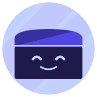

# Mimik

[English](../../README.md) · [Español](./README.es.md) · [Português (BR)](./README.pt-BR.md) · **Français** · [简体中文](./README.zh-CN.md)

**Capture n'importe quel flux dans ton navigateur et transforme-le en guide étape par étape. Pas de compte, pas de cloud, pas de tracking.**

Clique sur enregistrer, fais ce que tu as à faire, et récupère un guide soigné avec des captures annotées. Modifie, rejoue ou exporte.

<!-- SHIELD GROUP -->

[![License][license-shield]][license-link]
[![Manifest V3][mv3-shield]][mv3-link]
[![100% Local][local-shield]][local-link]
[![No Account][no-account-shield]][no-account-link]
 
[![Stars][star-shield]][star-link]
[![Contributors][contributors-shield]][contributors-link]
![Last Commit][last-commit-shield]
[![Issues][issues-shield]][issues-link]

<kbd>Sommaire</kbd>

#### TOC

- [📺 Démo](#-démo)
- [👋 Pour commencer](#-pour-commencer)
- [✨ Fonctionnalités](#-fonctionnalités)
  - [🔒 Flou intelligent](#-flou-intelligent)
  - [🧠 Descriptions par IA (optionnel)](#-descriptions-par-ia-optionnel)
  - [▶️ Lecture avec Guidez-moi](#️-lecture-avec-guidez-moi)
  - [🎙️ Narration vocale (optionnel)](#️-narration-vocale-optionnel)
  - [✏️ Éditeur de guides](#️-éditeur-de-guides)
  - [🔊 Voix off de la vidéo (option)](#-voix-off-de-la-vidéo-option)
  - [📤 Export multi-format](#-export-multi-format)
- [🔐 Confidentialité et stockage](#-confidentialité-et-stockage)
- [🤝 Contribuer](#-contribuer)
- [📜 Licence](#-licence)

 

## 📺 Démo

https://github.com/user-attachments/assets/f71f5898-ee5e-4b22-b9fd-d5b45af73459

## 👋 Pour commencer

Mimik transforme n'importe quelle tâche répétitive dans le navigateur en un guide documenté et partageable en quelques secondes. Tout tourne dans ton navigateur. Pas de backend, pas de compte, pas de télémétrie, et rien ne quitte ton appareil.

Que tu documentes des outils internes, que tu rédiges des tutoriels, ou que tu formes un collègue, Mimik capture chaque clic, frappe et navigation pour que tu puisses te concentrer sur le reste.

Chaque action utile devient une étape : clics sur les boutons et les liens, champs de formulaire, raccourcis clavier, actions du presse-papiers, glisser-déposer et navigations. Les clics rapprochés sur des éléments voisins sont fusionnés pour garder les guides propres, et le clic est intercepté avant que la page ne navigue, donc rien ne se perd sur les SPA ni sur les chargements complets.

Chaque étape reçoit une capture avec l'élément cliqué mis en évidence et zoomé. Pas de recadrage manuel, pas d'outil d'annotation à apprendre.

Besoin que l'enregistrement regarde ailleurs un instant ? **Pause** arrête la capture sans terminer l'enregistrement, et **Reprendre** repart où tu en étais. Entrer dans Flou intelligent la met en pause de la même façon.

| Navigateur | Version | Installation |
| ---------- | ------- | ------------ |
| Chrome     | [![Chrome Version][chrome-version-shield]][chrome-link]   | [Chrome Web Store][chrome-link] |
| Firefox    | [![Firefox Version][firefox-version-shield]][firefox-link] | [Firefox Add-ons][firefox-link]  |
| Edge       | [![Edge Version][edge-version-shield]][edge-link]          | [Microsoft Edge Add-ons][edge-link] |

Disponible en anglais, espagnol, portugais brésilien, français, allemand et chinois simplifié. La langue des descriptions IA se règle séparément, donc tu peux lancer Mimik en anglais et générer les guides en français, ou n'importe quelle combinaison.

> \[!IMPORTANT]
>
> **⭐️ Mets une étoile au repo** si Mimik te fait gagner du temps. Ça aide les autres à le découvrir.

[![Back to top][back-to-top]](#readme-top)

## ✨ Fonctionnalités

### 🔒 Flou intelligent

Flou intelligent est un mode que tu actives pendant l'enregistrement, pas un filtre toujours actif. Clique sur **Flou intelligent** et la capture se met en pause, Mimik détecte et masque les données sensibles de la page — e-mails, numéros de téléphone, numéros de sécu, cartes bancaires, IPs, adresses MAC — et les captures de cette page les gardent masquées une fois que tu cliques sur **Terminé**. Active ou désactive chaque catégorie indépendamment.

Besoin de cacher quelque chose de précis ? Le sélecteur manuel te laisse choisir n'importe quel élément du DOM et le masquer sur toutes les captures où il apparaît.

<strong>Ce que Flou intelligent ne couvre pas</strong>

 

Flou intelligent parcourt les nœuds de texte et les valeurs de champs du cadre principal de la page. Il reste de vraies lacunes, toutes structurelles. Si tu t'appuies dessus pour le RGPD ou l'équivalent, vérifie tes captures plutôt que de supposer qu'une capture propre est une capture sûre :

| Non couvert | Pourquoi |
|-------------|----------|
| Contenu dans les iframes | Ignoré entièrement ; les cadres cross-origin sont inaccessibles |
| Shadow DOM | Le parcours reste dans le document et n'entre pas dans les shadow roots |
| Texte dessiné sur un `<canvas>` et texte dans les images | Des pixels, pas du texte |
| Contenu CSS `::before` / `::after` | Pas un nœud de texte |
| Texte de `<select>` et `<option>` | Exclu du parcours |
| Valeurs présentes seulement dans un attribut, comme `title` ou `alt` | Seuls les nœuds de texte et les valeurs de champs sont lus |
| Les cadres autres que le principal | L'overlay et le parcours tournent uniquement dans le cadre principal |
| Tout onglet autre que celui où tu es entré dans le mode | Seul cet onglet est parcouru ; un second onglet sur la même app ne l'est pas |
| Le texte qui apparaît après **Terminé** | Le parcours s'arrête avec l'overlay : un re-render de la SPA, la page suivante d'une liste ou une navigation ne sont pas masqués — relance Blur là-bas |

Deux choses à savoir sur ce qui est bien traité : une correspondance dans un `<text>` SVG est retirée du rendu plutôt que floutée, car le masque est un élément HTML que SVG ne dessine pas — la donnée ne fuit pas, mais elle disparaît au lieu d'être floutée. Et un `<input>` ou `<textarea>` qui correspond est flouté **en entier**, pas seulement la partie qui correspond.

Le floutage s'applique à partir du moment où tu entres dans le mode. Les captures déjà prises ne sont pas masquées rétroactivement — supprime ces étapes dans l'éditeur.

https://github.com/user-attachments/assets/f30fbcde-a705-45aa-b7bd-374e4762e6be

[![Back to top][back-to-top]](#readme-top)

### 🧠 Descriptions par IA (optionnel)

Apporte ta propre clé API (OpenAI ou Anthropic) et Mimik génère des descriptions naturelles comme *« Clique sur le bouton **Envoyer** pour sauvegarder »* au lieu de `Click button "Submit"`.

Les descriptions sont générées à partir d'un contexte léger du DOM (~50-100 tokens), pas des captures. Environ 15-30x moins cher que les modèles vision. Choisis la langue des descriptions (anglais, espagnol, portugais, français, allemand, chinois).

https://github.com/user-attachments/assets/ce797986-56d1-4f72-b149-17463684cdd7

[![Back to top][back-to-top]](#readme-top)

### ▶️ Lecture avec Guidez-moi

Rejoue n'importe quel guide en direct sur une vraie page. Mimik met en évidence l'élément suivant, suit ta progression étape par étape, et avance tout seul au fur et à mesure. Parfait pour former un collègue ou se guider soi-même dans un process.

https://github.com/user-attachments/assets/8df5662f-e5e1-4a79-9c84-6f38becc4d03

[![Back to top][back-to-top]](#readme-top)

### 🎙️ Narration vocale (optionnel)

Parle à voix haute pendant que tu enregistres et Mimik transforme ce que tu as dit en descriptions
d'étapes. L'audio est transcrit avec ta propre clé (OpenAI ou Groq) puis rattaché à l'étape
correspondante, donc tu narres une fois au lieu d'écrire chaque étape à la main.

La transcription complète est conservée, pas seulement ce qui a atterri dans une étape. Ouvre
**Transcription** sur un guide pour voir tout ce que tu as dit, y compris les phrases rattachées à
rien, et ajoute celles que tu veux à une étape. Modifier une étape ne détruit pas non plus
l'original parlé : l'éditeur peut toujours remettre ce que tu as réellement dit. La transcription
reste sur ton appareil, ne fait jamais partie d'un guide exporté et est supprimée avec le guide.

https://github.com/user-attachments/assets/41ef17fd-0d02-4e17-81c6-30ba2b7c47d0

[![Back to top][back-to-top]](#readme-top)

### ✏️ Éditeur de guides

Corrige un guide après coup sans réenregistrer. Recadre, annote et masque n'importe quelle capture,
réécris une étape avec l'IA sans quitter l'éditeur, ajoute des titres et des notes entre les étapes,
réordonne ou supprime en lot, et reviens en arrière via l'historique de versions.

https://github.com/user-attachments/assets/b7eb0f6f-8957-4dbc-ab23-e23747719244

[![Back to top][back-to-top]](#readme-top)

### 🔊 Voix off de la vidéo (option)

Activez-la dans le panneau d'export et chaque étape de la vidéo est lue à voix haute, avec votre
propre clé OpenAI ou ElevenLabs. Si vous avez déjà renseigné une clé OpenAI pour les descriptions IA,
Mimik la réutilise : rien d'autre à créer, sauf si les descriptions IA passent par votre propre serveur, dont la clé reste là. Les étapes narrées restent à l'écran jusqu'à la fin de la
voix, donc rien n'est coupé, et les clips sont mis en cache localement pour que réexporter le même
guide ne coûte rien.

Désactivée par défaut : posséder une clé n'active jamais la narration, c'est vous qui l'activez.

https://github.com/user-attachments/assets/e82132e4-caf1-49db-9077-d6eade210a89

[![Back to top][back-to-top]](#readme-top)

### 📤 Export multi-format

Partage tes guides dans le format qui colle à ton flux :

- **Vidéo** : parcours narré, mp4/H.264, avec le curseur qui se déplace vers chaque cible — au choix avec une
  voix off ElevenLabs qui lit chaque étape, ce qui rend aussi la vidéo conforme à la Section 508
- **PDF** : prêt à imprimer, A4 portrait avec sauts de page auto
- **DOCX** : ouvre-le et continue dans Word
- **HTML** : autonome, à partager partout, images intégrées en base64
- **Markdown** : à coller dans Notion, GitHub, docs internes, wikis

Tous les exports sont générés côté client. Rien ne passe par un serveur.

https://github.com/user-attachments/assets/2a91221b-0f77-484d-9a47-74938a4ee585

[![Back to top][back-to-top]](#readme-top)

## 🔐 Confidentialité et stockage

Tes guides, étapes et captures restent sur ton appareil. Pas de backend, pas de compte, pas de télémétrie. Tes clés API (si tu en utilises) ne quittent jamais le navigateur. Elles sont stockées localement et servent à appeler directement le fournisseur que tu as choisi.

Si tu masques des données personnelles avant de partager un guide, lis d'abord [ce que Flou intelligent ne couvre pas](#-flou-intelligent) : il n'atteint ni les iframes, ni le shadow DOM, ni le texte dessiné dans une image.

Deux choses sortent bien du navigateur, toutes deux documentées dans la [politique de confidentialité](https://mimik.westpoint.io/privacy/) : les icônes de sites sont récupérées via le service de favicons de Google, ce qui envoie le domaine du site, et les fonctions optionnelles d'IA, de narration vocale et de voix off envoient du texte ou de l'audio au fournisseur que tu as configuré — la voix off envoie le texte de chaque étape au moment de l'export, et seulement si tu l'actives.

[![Back to top][back-to-top]](#readme-top)

## 🤝 Contribuer

Toute contribution est la bienvenue : rapports de bugs, idées, PR et traductions.

Voir [CONTRIBUTING.md](../../CONTRIBUTING.md) pour le setup dev, la structure du projet, et les règles pour contribuer.

[![Back to top][back-to-top]](#readme-top)

## 📜 Licence

MIT © [Westpoint](https://github.com/westpoint-io). Voir [LICENSE](../../LICENSE) pour les détails.

[![Back to top][back-to-top]](#readme-top)

<!-- LINK GROUP -->

[back-to-top]: https://img.shields.io/badge/-BACK_TO_TOP-1E1B4B?style=flat-square

[license-shield]: https://img.shields.io/badge/license-MIT-4F46E5?style=flat-square&labelColor=1E1B4B
[license-link]: ./LICENSE

[mv3-shield]: https://img.shields.io/badge/manifest-v3-3730A3?style=flat-square&labelColor=1E1B4B
[mv3-link]: https://developer.chrome.com/docs/extensions/mv3/intro/

[local-shield]: https://img.shields.io/badge/storage-100%25%20local-4F46E5?style=flat-square&labelColor=1E1B4B
[local-link]: #-stockage-100-local

[no-account-shield]: https://img.shields.io/badge/account-not%20required-4F46E5?style=flat-square&labelColor=1E1B4B
[no-account-link]: #-stockage-100-local

[star-shield]: https://img.shields.io/github/stars/westpoint-io/mimik?style=flat-square&label=stars&color=4F46E5&labelColor=1E1B4B
[star-link]: https://github.com/westpoint-io/mimik/stargazers

[contributors-shield]: https://img.shields.io/github/contributors/westpoint-io/mimik?style=flat-square&labelColor=1E1B4B
[contributors-link]: https://github.com/westpoint-io/mimik/graphs/contributors

[last-commit-shield]: https://img.shields.io/github/last-commit/westpoint-io/mimik?style=flat-square&label=commit&labelColor=1E1B4B

[issues-shield]: https://img.shields.io/github/issues/westpoint-io/mimik?style=flat-square&labelColor=1E1B4B
[issues-link]: https://github.com/westpoint-io/mimik/issues

[chrome-version-shield]: https://img.shields.io/chrome-web-store/v/jmfohdaflahliammccpiadmkcibohgha?label=Chrome%20Version&style=flat-square&logo=googlechrome&logoColor=C7D2FE&color=4F46E5&labelColor=1E1B4B
[chrome-link]: https://chromewebstore.google.com/detail/mimik/jmfohdaflahliammccpiadmkcibohgha
[firefox-version-shield]: https://img.shields.io/amo/v/mimik?label=Firefox%20Version&style=flat-square&logo=firefoxbrowser&logoColor=C7D2FE&color=4F46E5&labelColor=1E1B4B
[firefox-link]: https://addons.mozilla.org/en-US/firefox/addon/mimik/
[edge-version-shield]: https://img.shields.io/badge/dynamic/json?url=https%3A%2F%2Fmicrosoftedge.microsoft.com%2Faddons%2Fgetproductdetailsbycrxid%2Fhgjemhfoffebbollleajkpefblppleai&query=%24.version&label=Edge%20Version&style=flat-square&logo=microsoftedge&logoColor=C7D2FE&color=4F46E5&labelColor=1E1B4B
[edge-link]: https://microsoftedge.microsoft.com/addons/detail/hgjemhfoffebbollleajkpefblppleai
